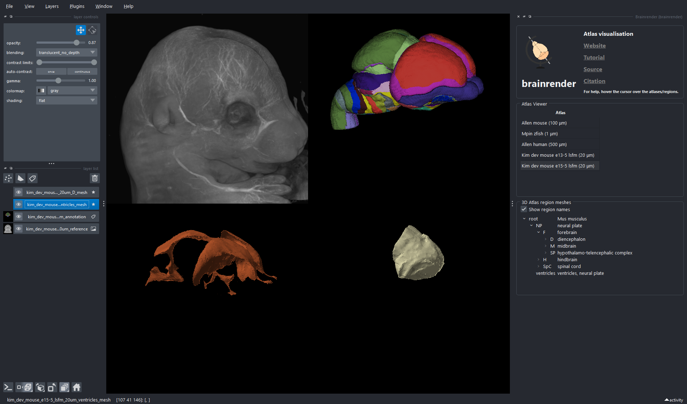
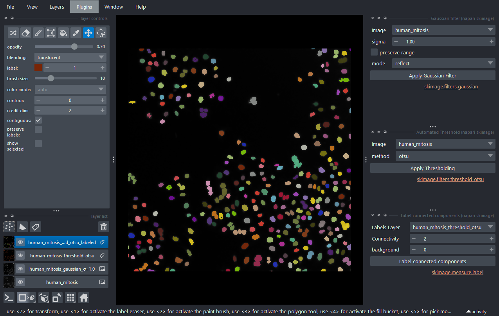

# Demo Repo for Various napari Presentations

## Setup instructions

You can run scripts with uv without creating an environment due to inline dependency management.

`uv run scripts/weather_data.py`

Alternatively, create a virtual environment and install the project dependencies, which covers most of the demos here.

With uv:

```bash
uv sync
.venv\Scripts\activate  # macOS/Linux: source bin/activate 
```

With conda:

```bash
conda create -n napari-demo python=3.12
conda activate napari-demo
pip install -e .
```

Alternatively, you can make a temporary install of napari with uv:

`uvx --with "napari[pyqt6,optional,docs]>=0.6.2" napari`

## Other Ideas

### Brainrender with napari

`uvx --with "napari[pyqt6,optional]" --with brainrender-napari -p 3.12 napari`



## napari with skimage and sample data

`uvx --with napari-skimage --with ndev-sampledata --with napari-bio-sample-data --with napari[pyqt6,optional] -p 3.12 napari`

